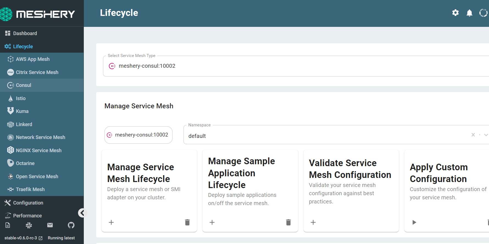
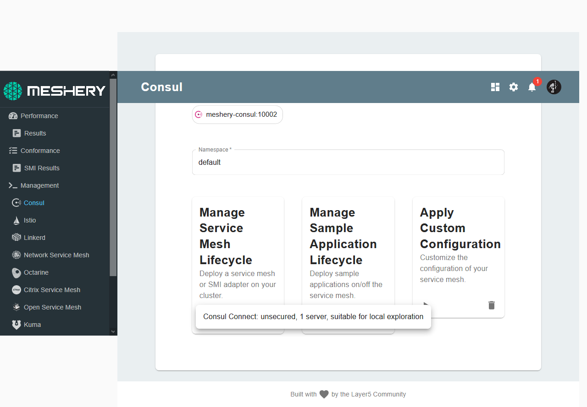
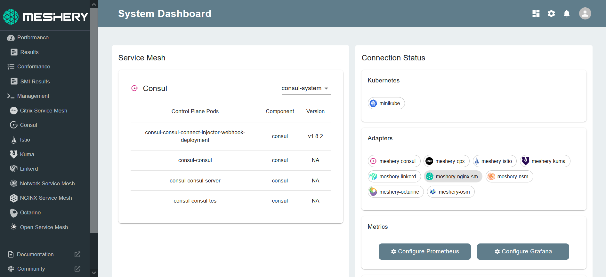

Consul can be manually installed on your Kubernetes cluster as well. Meshery offers a simple alternative way to do so. 

## 1. Select `Consul` from the Management menu

## 2. In the Consul management page:

- Type `consul-system` into the namespace field
- Click the (+) icon on the Install card and select `Consul Connect..` to install Consul. Currently, the server isonly suitable for local exploration.

To check if Istio is along with all the pieces that have been deployed, execute the following:

`kubectl get all -n consul-system`{{execute}}

The details of your configuration will also be reflected on the Meshery dashboard:

