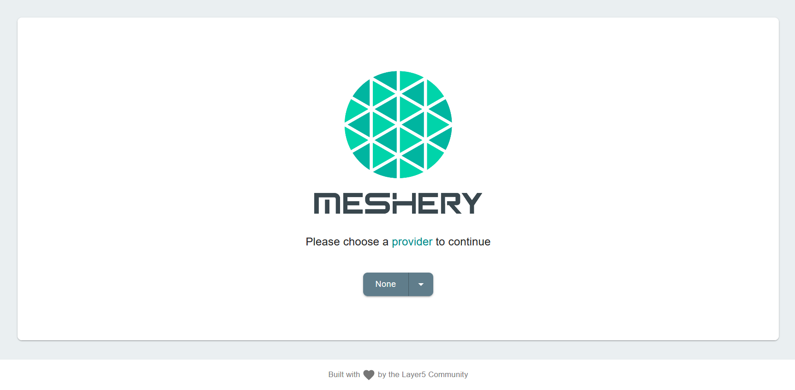

This lab starts with an already running Kubernetes cluster. You may check up on your cluster nodes by executing:

`kubectl get nodes`{{execute}}

## Setup Meshery

Meshery can be downloaded, installed, and launched with a single command:

`curl -L https://git.io/meshery | ADAPTERS=istio PLATFORM=kubernetes bash -`{{execute}}

**Congratulations!** You have successfully installed Meshery and the Meshery Adapter for Istio.

Meshery is now available at host:`9081`.

Find the **Meshery UI** tab is configured to be listening at `http://localhost:9081`/

- Click on the **Meshery UI** tab
- Click on **Display Port**

**Welcome to Meshery!**

Choose **None** as your provider for now and get started.

## Connect your cluster with Meshery

Meshery will auto-connect with your Minikube cluster by loading the kubeconfig found in your `$HOME/.kube` folder.

**Check up on your connection**

You may check up on the connections between Meshery and your server anytime by performing `ad hoc` tests to ensure a successful connections:

1. Between Meshery and your cluster - Click on your `configuration name` (in this scenario, `minikube`)

2. Between Meshery and your chosen adapter by clicking on the adapter name corresponding to the service mesh you have installed

