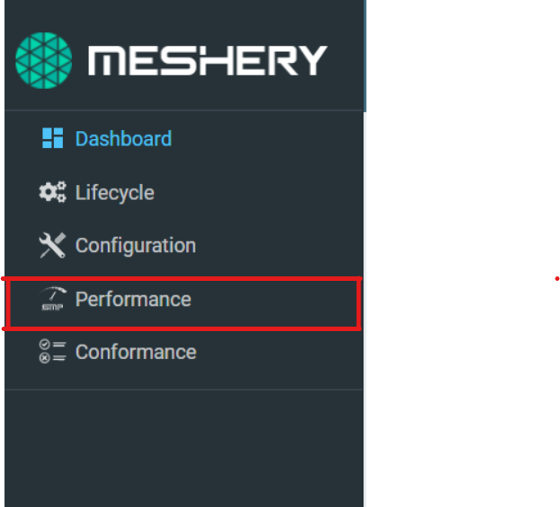
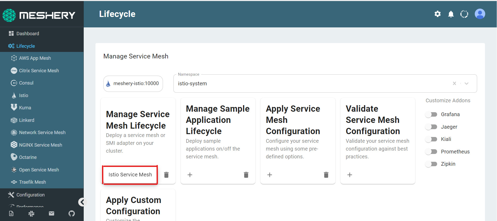
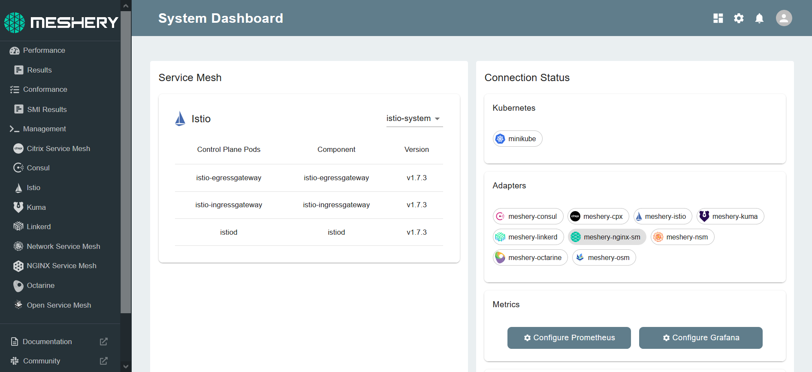

Meshery allows you to install any service mesh with a single click:

## 1. Select `Istio` from the Management menu

## 2. In the Istio management page:

- Type `istio-system` into the namespace field
- Click the (+) icon on the Install card and select `Istio 1.7.3` to install the latest version of Istio

## Check for successful installation

Istio has been deployed in a separate Kubernetes namespace istio-system. To check if Istio is along with all the pieces that have been deployed, execute the following:

`kubectl get all -n istio-system`{{execute}}

The details of your configuration will also be reflected on the Meshery dashboard:

