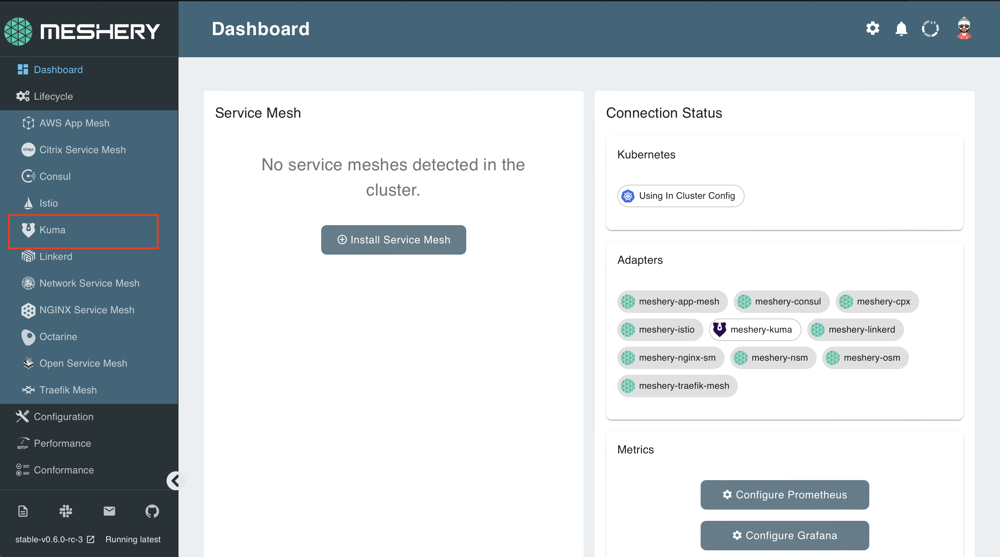
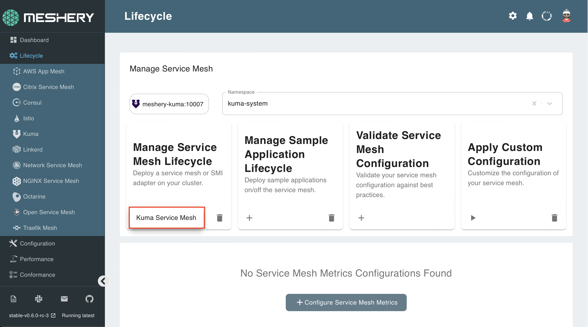

Kuma can be installed on Meshery with one click! 

## 1. Select `Kuma` from the Management menu

## 2. In the Kuma management page:

- Type `kuma` into the namespace field
- Click the (+) icon on the Install card and select `Latest Kuma` to install the latest version of Istio

To check if Istio is along with all the pieces that have been deployed, execute the following:

`kubectl get all -n kuma-system`{{execute}}

The details of your configuration will also be reflected on the Meshery dashboard:

