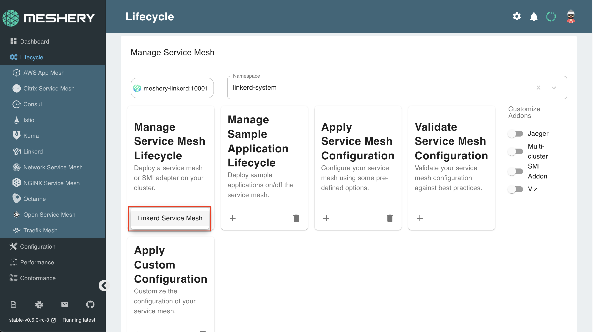
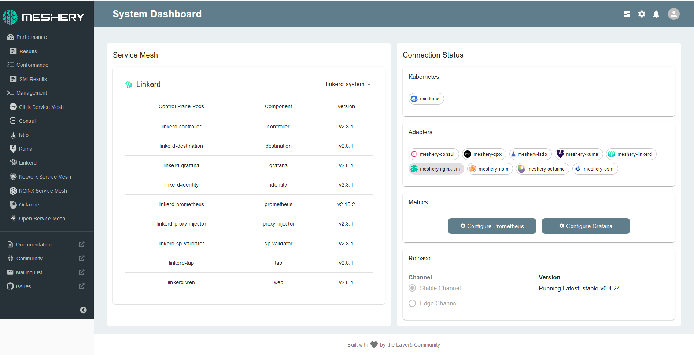

Linkerd can be installed on Meshery with one click! 

## 1. Select `Linkerd` from the Lifecycle menu

## 2. In the Linkerd management page:

- Type `linkerd-system` into the namespace field.
- Click the (+) icon on the Manage Service Mesh Lifecycle card and select `Linkerd Service Mesh` to install the latest version of Linkerd

You can verify the successful installation of Linkerd on your Meshery instance by running:
`kubectl get all -n linkerd-system`{{execute}}
You can continue to next step after all the components displayed on the terminal after running this command, are in ready state.

The same can be seen on your Meshery dashboard:

