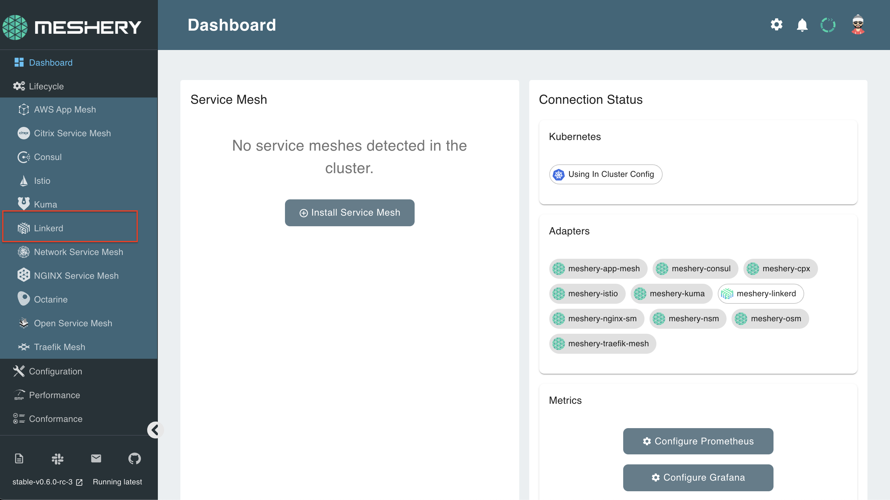
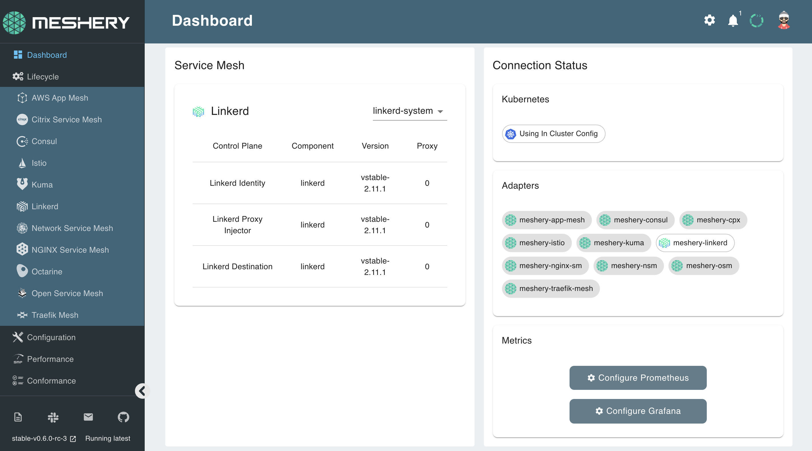

Linkerd can be installed on Meshery with one click! 

## 1. Select `Linkerd` from the Management menu

## 2. In the Linkerd management page:

- Type `linkerd-system` into the namespace field
- Click the (+) icon on the Install card and select `Latest Linkerd` to install the latest version of Istio

You can verify the successful installation of Linkerd on your Meshery instance by running:
`kubectl get all -n linkerd-system`{{execute}}

The same can be seen on your Meshery dashboard:

