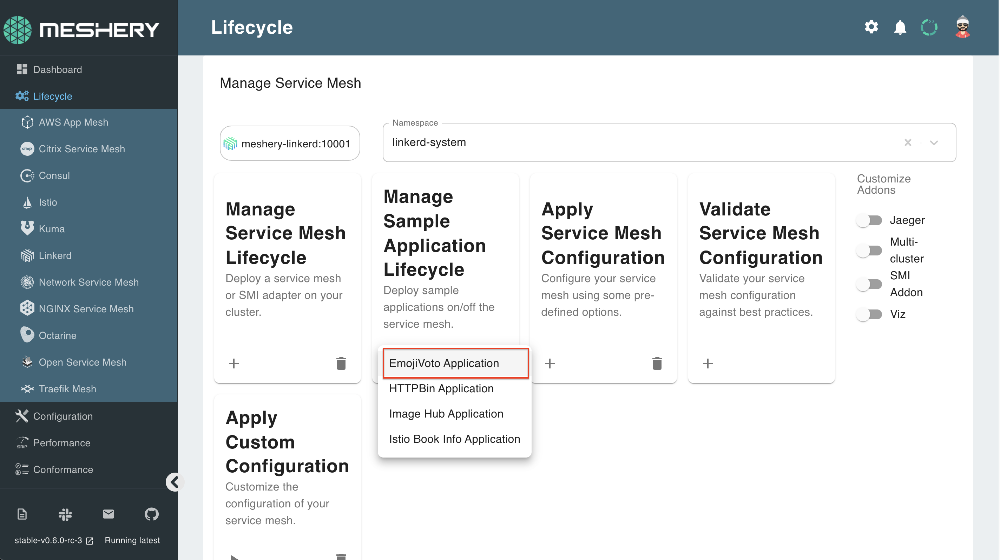

Let's deploy a sample application to run on Linkerd to get you better acquainted with the various feeatures of Linkerd and Meshery.

## Emojivoto 

This is a microservice application that allows users to vote for their favorite emoji, and tracks votes received on a leaderboard. 

## Sidecar proxy injection

A sidecar injector is used for automating the injection of the Linkerd proxy into your application's pod spec. The Kubernetes admission controller enforces this behavior by sending a webhook request to the sidecar injector every time a pod is to be scheduled.

You have already deployed the sidecar proxy injector when you installed linkerd, which should be running in your control plane. To verify, execute this command:

`kubectl get deployment linkerd-proxy-injector -n linkerd-system`{{execute}}

Upon successful deployment, the output should look like:

|NAME                   | READY | UP-TO-DATE | AVAILABLE |  AGE  |
|-----------------------|-------|------------|-----------|-------|
|linkerd-proxy-injector |  1/1  |      1     |     1     | 9m49s |

## Run Emojivoto

To deploy the Emojivoto application, follow these steps:
 
 - Using Meshery, navigate to the Linkerd management page.
 - Enter `default` in the Namespace field. This is the namespace in which we will be defining and deploying the Sample Application.
 - Click the (+) icon on the Sample Application card and select `Emojivoto Application` from the list.

 

 

**Let's verify that your deployment works. Run**:

`watch kubectl get deployment -n default`{{execute}} 

Sample Output: 

|   NAME   | READY | UP-TO-DATE | AVAILABLE |  AGE  |
|:--------:|:-----:|:----------:|:---------:|:-----:|
|   emoji  |  1/1  |      1     |     1     | 4m37s |
| vote-bot |  1/1  |      1     |     1     | 4m38s |
|  voting  |  1/1  |      1     |     1     | 4m38s |
|   web    |  1/1  |      1     |     1     | 4m38s |

### Let's inspect our pod:

1. View the details of the deployed pods:

    `watch kubectl get po -n default`{{execute}} 

If you cannot see the *Ready* column updated, this is because the deployment can take up upto a minute. When the deployment is complete, the page will auto-refresh. You can use `CTRL+ C` to switch back to the terminal.

2. View the details of the services:

    `watch kubectl get svc -n default`{{execute}} 

3. Choose one of Emojivoto's services (e.g. web-svc), and view it's sidecar configuration:

    `kubectl get svc -n default`{{execute}}

    `kubectl describe svc/web-svc -n default`{{execute}}

4. Assess the application deployment by port-forwarding the web-svc service:

    `kubectl port-forward svc/web-svc 80:80 --address 0.0.0.0 -n default`{{Execute}}

**Success!**
The `emojivoto` sample application has now been onboarded on to your Linkerd instance. As a final check, let's verify your data plane environment with this check:

`linkerd -n emojivoto check --proxy`{{execute}}

The Emojivoto sample application should now be deployed at HTTP port:`8080`. Make your way to the `Linkerd-Emojivoto` Server tab. For this tutorial, the server is configured to be listening at `http://localhost:8080`

**Note**: The Sample Application may take upto a minute to deploy. Please be patient

