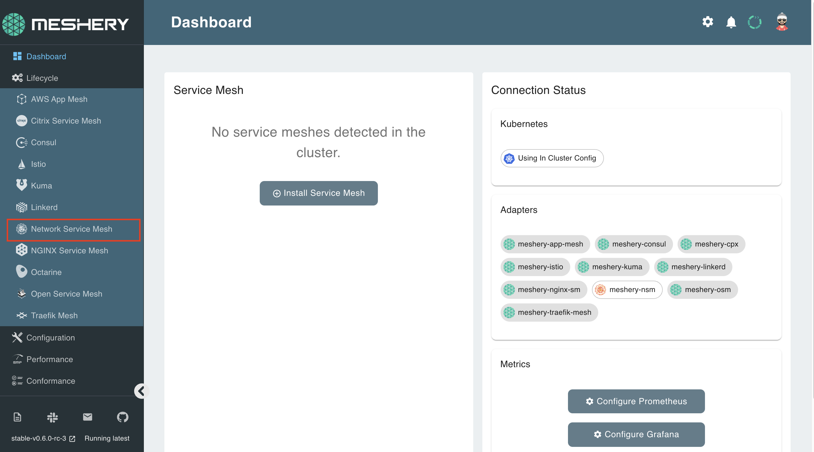
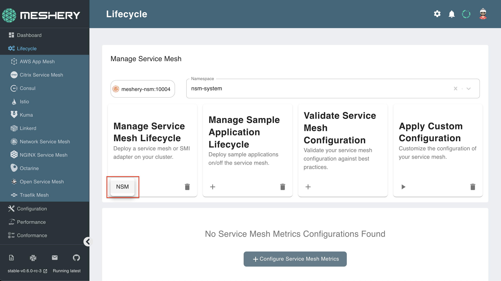
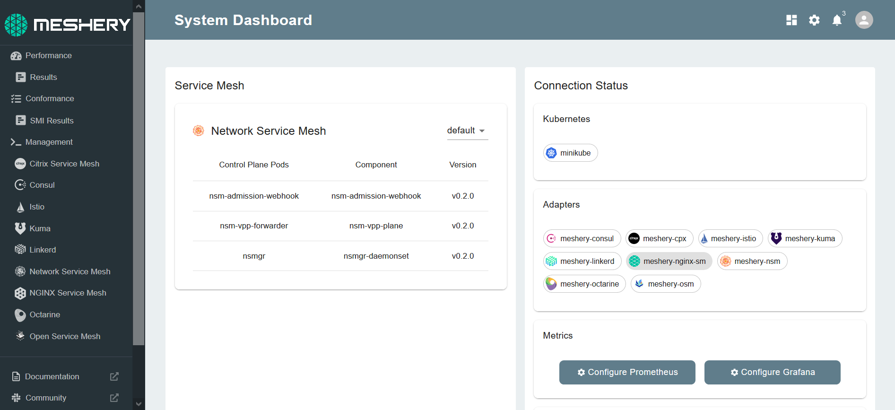

Meshery allows you to install any service mesh with a single click:

## 1. Select `NSM` from the Management menu

## 2. In the Istio management page:

- Type `nsm-system` into the namespace field
- Click the (+) icon on the Install card and select `Network Service Mesh` to install the latest version of Istio

## Check for successful installation

NSM has been deployed in a separate Kubernetes namespace: nsm-system. To check if NSM is along with all the pieces that have been deployed, execute the following:

`kubectl get all -n nsm-system`{{execute}}

The details of your configuration will also be reflected on the Meshery dashboard:

 
