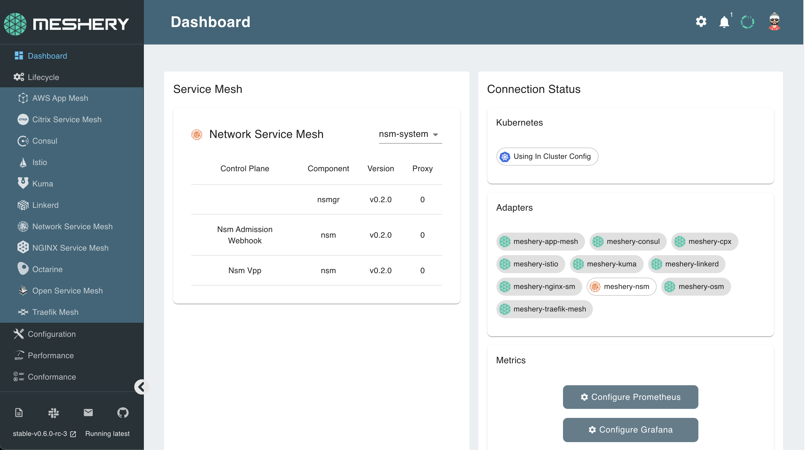

Meshery allows you to install any service mesh with a single click:

## 1. Select `NSM` from the Management menu

## 2. In the NSM management page:

- Type `nsm-system` into the namespace field
- Click the (+) icon on the Manage Service Mesh Lifecycle card and select `NSM` to install the latest version of NSM

## Check for successful installation

NSM has been deployed in a separate Kubernetes namespace: nsm-system. To check if NSM is along with all the pieces that have been deployed, execute the following:

`kubectl get all -n nsm-system`{{execute}}
You can continue to next step after all the components displayed on the terminal after running this command, are in ready state.

The details of your configuration will also be reflected on the Meshery dashboard:

 
