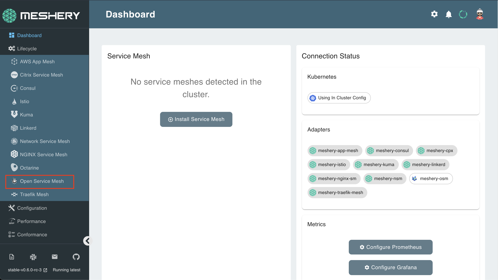
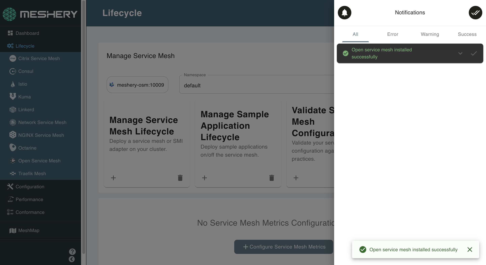

Meshery allows you to install any service mesh with a single click:

## 1. Select `Open-Service-Mesh` from the Management menu

## 2. In the Open Service Mesh management page:

- Type `osm-system` into the namespace field
- Click the (+) icon on the Install card and select `Open Service Mesh` to install the latest version of Open Service Mesh

## Check for successful installation

Open Service Mesh has been deployed in a separate Kubernetes namespace: osm-system. To check if Open Service Mesh is along with all the pieces that have been deployed, execute the following:

`kubectl get all -n osm-system`{{execute}}

The details of your configuration will also be reflected on the Meshery dashboard:

