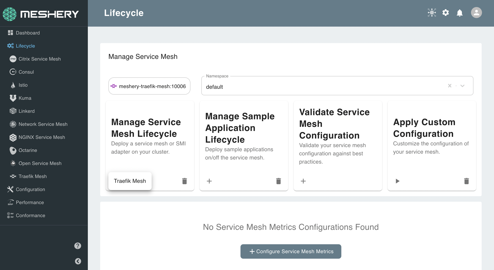

Meshery allows you to install any service mesh with a single click:

## 1. Select `Traefik-Mesh` from the Management menu

## 2. In the Traefik Mesh management page:

- Type `traefik-system` into the namespace field
- Click the (+) icon on the Install card and select `Traefik Mesh` to install the latest version of Traefik Mesh

## Check for successful installation

Traefik Mesh has been deployed in a separate Kubernetes namespace: traefik-system. To check if Traefik Mesh is along with all the pieces that have been deployed, execute the following:

`kubectl get all -n traefik-system`{{execute}}

The details of your configuration will also be reflected on the Meshery dashboard:

