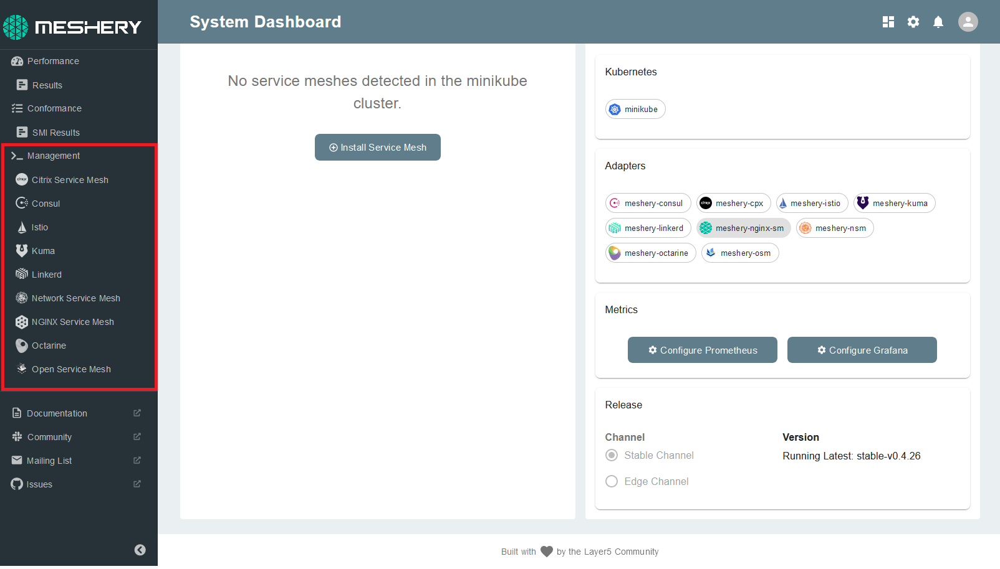
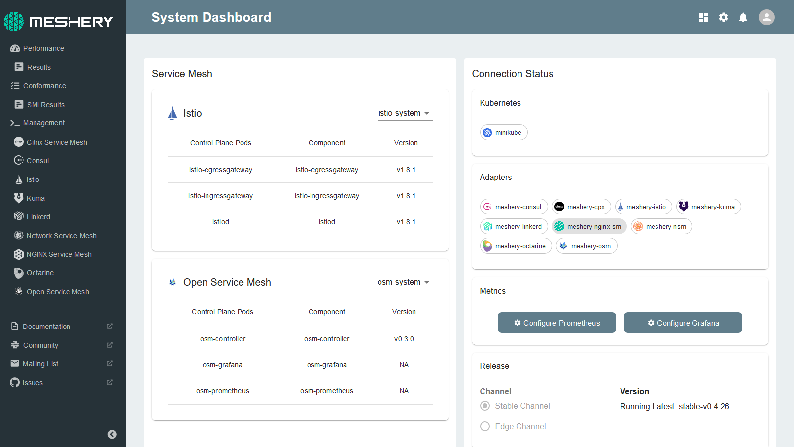

Performance tests can be used to examine and analyze the behavior of any service mesh you choose to deploy.

## Install your service mesh

Meshery allows for easy, one-click installations. Follow the steps below to install atleast two service meshes to run performance tests on:

## 1. Select the service mesh you wish to deploy from the Management menu

## 2. Navigate to the service mesh's management page:

For the purpose of this session, we will be working with Istio and Linkerd. However, you can perform the session with any service meshes you choose.

_Note_ : If you are using other service meshes, any changes to the steps (if required) will be highlighted in the session instructions.

- Type `default` into the namespace field
- Click the (+) icon on the Install card and select the latest version to install

## Check for successful installation

The service mesh has been deployed in the default namespace. You will now be able to see the successful deployment status of the service meshes you have installed on your Meshery dashboard:

You may also manually run the following command from the terminal to check for successful configurations:

`kubectl get all -n <namespace>`{{copy}}

_Note_ : You can paste in the command in the terminal with Shift + Insert and switch the namespace with respect to the service mesh you wish to check for.

