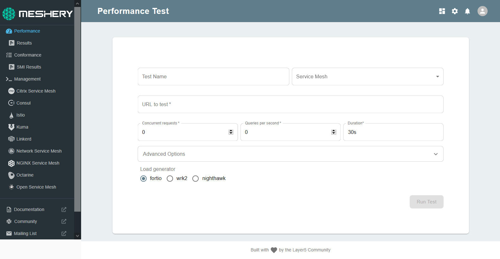

Meshery allows you to run performance tests directly from your dashboard. 

Go to <i class="fa fa-dashboard" style="font-size:24px"></i> **Performance**

The Performance test asks for the following inputs:

- Test Name: Enter any test name that you wish. If you do not provide one, a random name will be generated for you.

- Service Mesh: Choose the service mesh you wish to run the performance test on. For this session, choose either Istio or OSM.

- URL to test: Enter the URL of the page you wish to run the test on. For *Istio*, paste in the URL of the BookInfo productpage dashboard deployed in the last step.

- Concurrent Requests: Enter a valid number for Concurrent Requests

- Queries per second: Enter a valid number for Queries per second

- Duration: Type in the duration for which you want to tes

- Load generator: Choose the [Load generator](http://docs.meshery.io/functionality/performance-management#load-generators) you wish to base the test on. Meshery supports fortio, wrk2, and Nighthawk. 

Click on `**Run Test**`.

To be able to compare, repeat the same test for *Linkerd* by pasting in the URL of the Emojivoto dashboard. We have already deployed the app in last step. It should now be running on port 80.
