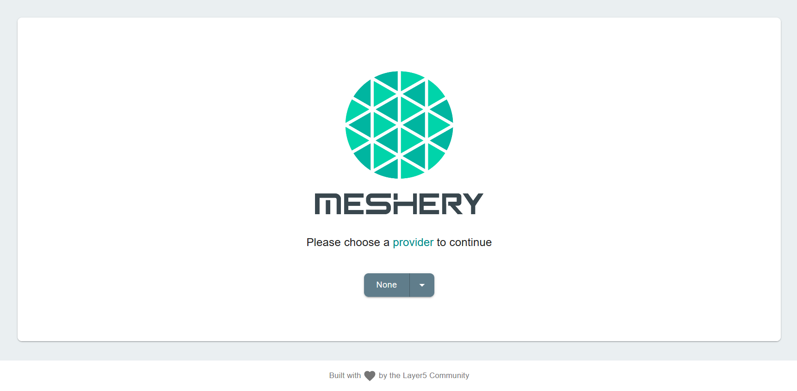
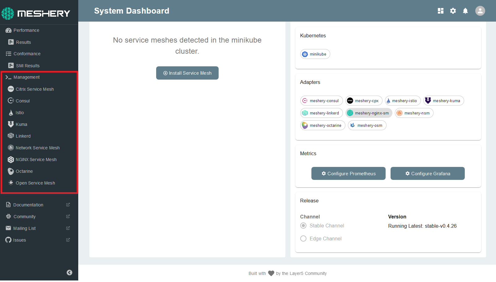
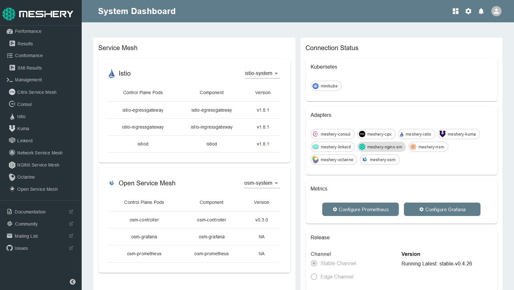

This session will auto-install **`minikube`** and set up other environment variables, necessary to run Meshery for you. This may take up to 2 minutes. 

After the environment has been setup, you may check up on your cluster nodes by running:
`kubectl get nodes`{{execute}}

## Set up Meshery

Meshery can be downloaded, installed, deployed and auto-launched with a single command:

`curl -L https://git.io/meshery | bash -`{{execute}}

**Congratulations!** You have successfully installed Meshery.

Meshery is auto launched at host:`9081`. 

For this tutorial session, the **Meshery Server** tab is configured to be listening at `http://localhost:9081`/

- Click on the **Meshery Server** tab
- Click on **Display Port**

**Welcome to Meshery!**

Choose **None** as your provider for now and get started.

## Connect your cluster with Meshery

Meshery will auto-connect with your Minikube cluster by loading the kubeconfig found in your `$HOME/.kube` folder.

## Install your service mesh

Meshery allows for easy, one-click installations. Follow the steps below to install atleast two service meshes to run performance tests on:

1. **Select the service mesh you wish to deploy from the Management menu**

2. **Navigate to the service mesh's management page** 

For the purpose of this session, we will be working with Istio and Linkerd. However, you can perform the session with any service mesh(es) you choose.

_Note_ : If you are using other service meshes, any changes to the steps (if required) will be highlighted in the session instructions.

- Type `default` into the namespace field
- Click the (+) icon on the Install card and select the latest version to install

3. **Check for successful installation**

The service mesh has been deployed in the default namespace. You will now be able to see the successful deployment status of the service meshes you have installed on your Meshery dashboard:

