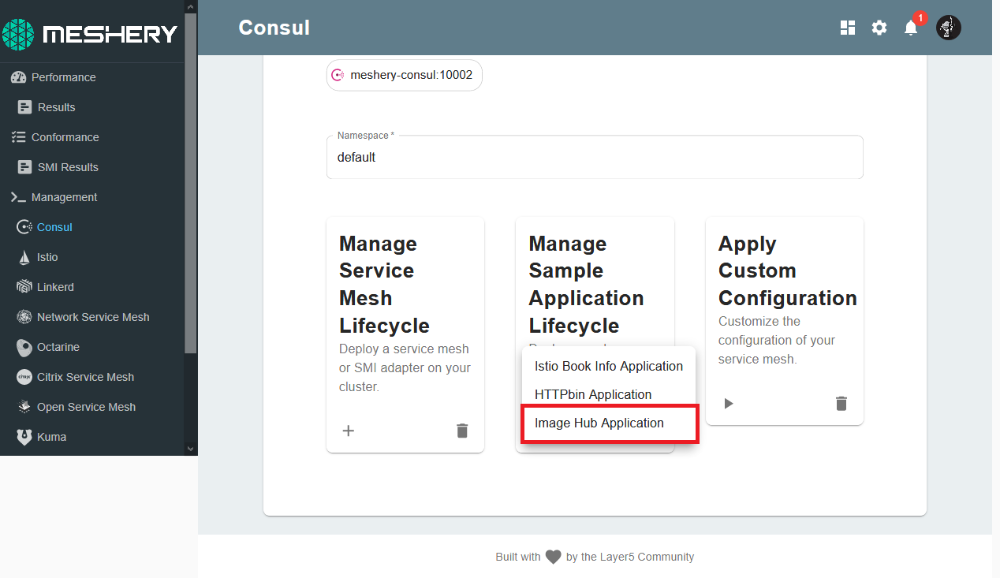
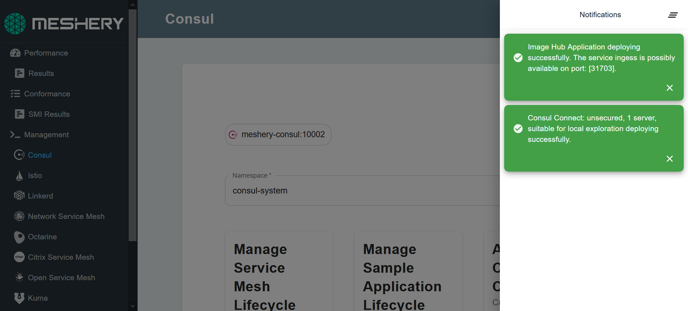

[Image Hub](https://github.com/layer5io/image-hub) is a sample app created by the Layer5 community with the purpose of exploring Web Assemblies using WASM filters.

## Deploy Imagehub on Consul

- Navigate to the **Consul Management** page on Meshery with `consul-system` in the Namespace field.
- Select the `Image Hub application` in the `Sample Application` drop down menu.



You will be notified of successful deployment:



## Access Imagehub

Once you have your ingess pods set up, let's find the port assigned to them:

`kubectl get svc ingess`{{execute}}

Example Output:

```
kubectl get svc ingess
NAME     TYPE       CLUSTER-IP    EXTERNAL-IP   PORT(S)        AGE
ingess   NodePort   10.97.34.25   <none>        80:31118/TCP   27m
```

The Image Hub application should now be deployed on the HTTP port: `31118`. Make your way to the `Consul ImageHub` Server tab. For this tutorial, the server is configured to be listening at `http://localhost:31118`


You can now test your ability to "pull" an image (images are not in fact pulled, but an HTTP request is sent to the backend api). *You should not be able to pull an image.*

### Sign up

- Sign up a new user and select a subscription plan.
- Login as that user.
- Test your ability to "pull" an image. *You should be able to pull an image.*

Navigate to the **Meshery Server tab>Meshery>performance management page** 
On local deployment, the URL would be `http://localhost:9081/performance`{{copy}}

### Performance Tests

- Configure a performance test against `http://x.x.x.x:31118/api/pull`{{copy}} (where x.x.x.x is your **machine's host IP address**, not "localhost")

- Enter { "authorization" : "<your user token>" }
- Run the performance test. Ensure that your subscription plan limit is enforced accordingly.
- Change your subscription plan and retest.

