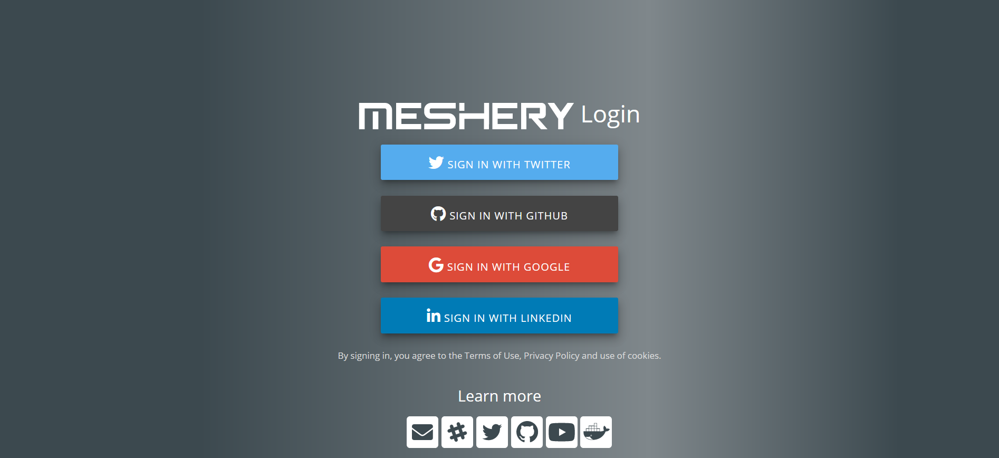

**Build the Meshery server:**

`make run-local`{{execute}}

Switch to the `Web Preview` tab on the terminal and go to port: `9081`.

**Welcome to Meshery!**

Choose `Meshery` as your provider for now and get started.

Sign up and start meshing around!
