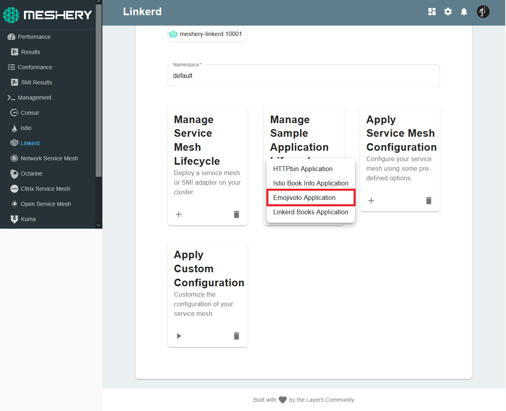

Let's deploy a sample application to run on Istio to get you better acquainted with the various feeatures of Linkerd and Meshery.

## Emojivoto 

This is a microservice application that allows users to vote for their favorite emoji, and tracks votes received on a leaderboard. 

## Sidecar proxy injection

A sidecar injector is used for automating the injection of the Linkerd proxy into your application's pod spec. The Kubernetes admission controller enforces this behavior send sending a webhook request the the sidecar injector every time a pod is to be scheduled.


You have already deployed the sidecar proxy injector, which should be running in your control plane. To verify, execute this command:

`kubectl get deployment linkerd-proxy-injector -n linkerd`{{execute}}

Upon successful deployment, the output should look like:

```
NAME                     READY   UP-TO-DATE   AVAILABLE   AGE
linkerd-proxy-injector   1/1     1            1           9m49s
```

## Run Emojivoto

To deploy the Emojivoto application, follow these steps:
 
 - Using Meshery, navigate to the Linkerd management page.
 - Enter `default` in the Namespace field.
 - Click the (+) icon on the Sample Application card and select `Emojivoto Application` from the list.

 


**Let's verify that your deployment works. Run**:

`watch kubectl get deployment -n emojivoto`{{execute}} 

### Let's inspect our pod:

1. View the details of the deployed pods:

    `watch kubectl get po -n emojivoto`{{execute}} 

2. View the details of the services:

    `watch kubectl get svc -n emojivoto`{{execute}} 

3. Choose one of Emojivoto's services (e.g. web-svc), and view it's sidecar configuration:

    `kubectl get svc -n emojivoto`{{execute}}

    `kubectl describe service svc/web-svc -n emojivoto`{{execute}}

4. Assess the application deployment by port-forwarding the web-svc service:

    `kubectl port-forward svc/web-svc 8080:80  -n emojivoto`{{Execute}}

**Success!**
The `emojivoto` sample application has now been onboarded on to your Linkerd instance. As a fianl check, let's verify your data plane environment with this check:

`linkerd -n emojivoto check --proxy`{{execute}}

The Emojivoto sample application should now be deployed at HTTP port:`8081`. Make your way to the `Linkerd-Emojivoto` Server tab. For this tutorial, the server is configured to be listening at `http://localhost:8081`


